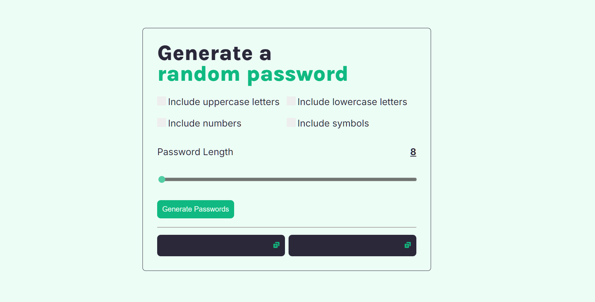

# Password generator

[Live demo](https://rame0033.github.io/password-generator/)

Project courtesy of [Scrimba](https://v2.scrimba.com/learn-javascript-c0v/~03f) - this is another practice for JavaScript with regards to learning `loops`, `objects`, ` arrays`, `Math.floor`, `Math.random()`

The password generator is being initialized to randomize 15 characters to form a new set of password. Added a copy to clipboard functionality feature to easily copy the generated password and use it right away.

### Updated (August 10, 2024)

- Add range selector for adjustable character length.

---

From the fixed length of `15 characters`, the option of having an initial value of `8` and maximum of `30` characters been added to give flexibility to the user. 

- Character selection for passwords

---

Instead of the fixed randomizer, it is now allowed for users to select which types of characters they want to include in their password to enhance security and flexibility.
