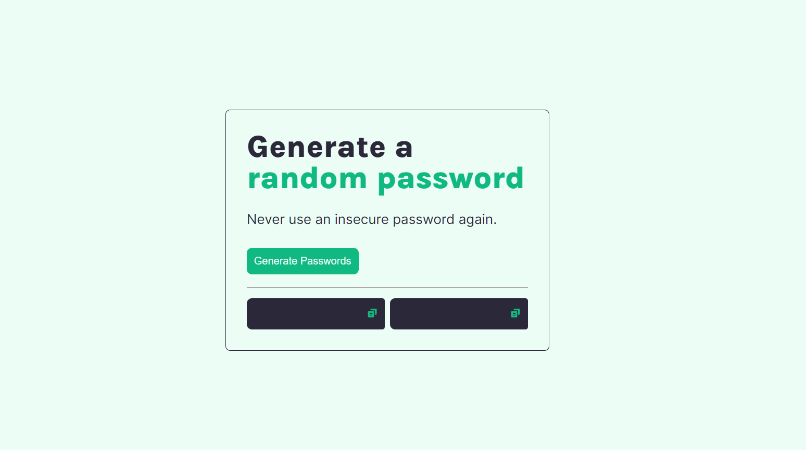

# Password generator

[Live demo](https://rame0033.github.io/password-generator/)

Project courtesy of [Scrimba](https://v2.scrimba.com/learn-javascript-c0v/~03f) - this is another practice for JavaScript with regards to learning `loops`, `objects`, ` arrays`, `Math.floor`, `Math.random()`

The password generator is being initialized to randomize 15 characters to form a new set of password. Added a copy to clipboard functionality feature to easily copy the generated password and use it right away.

